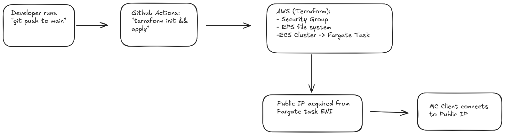

# Minecraft Server on AWS Fargate

## Background

This project allows for the fully automated deployment of a Minecraft 
Java Edition server on AWS using Terraform and ECS Fargate, 
with persistent world data on EFS and a GitHub Actions pipeline that deploys on push.

The pipeline broadly does the following:

- Provisions a security group, an EFS file system with mount targets in every
  default-VPC subnet, an ECS cluster, a Fargate task definition, and a service
  that keeps one task running.
- Uses the [`itzg/minecraft-server`](https://hub.docker.com/r/itzg/minecraft-server)
  Docker image as the server. The image handles downloading the Minecraft
  server jar, accepting the EULA, and running the JVM.
- Mounts EFS at `/data` inside the container so the world survives task
  restarts and redeployments.
- Runs `terraform apply` from GitHub Actions on every push to `main`.

The container runs Minecraft `26.1.2` (Java Edition) and listens on TCP 25565.


## Requirements

- AWS account with the `LabRole` IAM role (default in AWS Academy Learner Lab).
- AWS CLI (v2)
- Terraform >= 1.6 (only needed for local runs).
- A `[default]` profile in `~/.aws/credentials` with valid credentials.
- For Actions: three repo secrets under
  **Settings → Secrets and variables → Actions**:
  - `AWS_ACCESS_KEY_ID`
  - `AWS_SECRET_ACCESS_KEY`
  - `AWS_SESSION_TOKEN`


## Pipeline



1. `git push` to `main` triggers the GitHub Actions workflow.
2. Actions installs Terraform and runs `terraform init` + `terraform apply`.
3. Terraform creates the security groups, EFS file system, ECS cluster, task
   definitions, and service in the default VPC.
4. The Fargate service launches a task running the `itzg/minecraft-server`
   docker container. EFS is mounted at `/data`, and the container downloads the
   server jar on first run.
5. The task gets a public IP via its ENI. Players connect on port 25565.

The workflow uses the official [`configure-aws-credentials`][aws-creds-action]
action to pass the lab credentials into the runner, and
[`setup-terraform`][setup-terraform] to install Terraform.

## Deployment Tutorial

This walks through deploying the server from scratch. Two paths are
documented: via GitHub Actions (production workflow) and locally with
Terraform (useful for development and debugging).

### 1. Clone the repo

```bash
git clone https://github.com/jra-xyz/minecraft_server_312.git
cd minecraft_server_312
```

### 2. Set up AWS credentials

Navigate to your AWS dashboard.

**AWS Details → AWS CLI →
Show** and note the three values displayed: access key ID, secret access
key, and session token.

Locally, run `aws configure` to set the access key, secret key, and region. Press
Enter to accept the default output format:

```bash
aws configure
```

If you are using a Learner Lab account, and you are not prompted for a session token,
run the following to set it manually:

```bash
aws configure set aws_session_token "<paste-token-here>"
```

Verify it works:

```bash
aws sts get-caller-identity
```

You should see a JSON response with your account ID.

### 3. Deploy via GitHub Actions

Fork or push this repo to your own GitHub account, then in the repo settings
go to **Settings → Secrets and variables → Actions** and add three secrets
with the same values you put in `~/.aws/credentials`:

- `AWS_ACCESS_KEY_ID`
- `AWS_SECRET_ACCESS_KEY`
- `AWS_SESSION_TOKEN`

Push an empty commit to `main`, or go to the **Actions** tab and click **Run
workflow** on the "Deploy Minecraft Server" workflow. Watch the run in the
Actions UI. Startup should complete in a few minutes.

### 3 (alternative step for debugging). Deploy locally 

Skip this step if you wish to use the intended production workflow defined above. 
If you'd rather not use Github Actions and instead apply from your own machine,
install Terraform 1.6 or newer, then:

```bash
cd terraform
terraform init
terraform apply
```

Type `yes` at the prompt. Apply takes 3-4 minutes.

### 4. Connect to the server

After the apply finishes, the Fargate task needs another 1-2 minutes to
download the server jar and generate the world. You can watch its progress:

```bash
aws logs tail /ecs/minecraft --follow
```

Wait for a line that ends with `Done (XX.XXXs)! For help, type "help"`, then
press Ctrl+C.

Get the task's public IP from the ECS console: **ECS → minecraft-cluster →
Tasks → click the task → Public IP**.

Alternatively, to get the public IP via the AWS CLI run:

```bash
TASK=$(aws ecs list-tasks --cluster minecraft-cluster --query 'taskArns[0]' --output text)
ENI=$(aws ecs describe-tasks --cluster minecraft-cluster --tasks $TASK --query 'tasks[0].attachments[0].details[?name==`networkInterfaceId`].value' --output text)
aws ec2 describe-network-interfaces --network-interface-ids $ENI --query 'NetworkInterfaces[0].Association.PublicIp' --output text
```

What each step does:

- `list-tasks` returns the ARN of the running task in the cluster.
- `describe-tasks` checks the task's `attachments` to find its ENI ID. The
  `--query` filters down to just the value of the `networkInterfaceId` detail.
- `describe-network-interfaces` asks EC2 for the ENI's public IP.

The output should be just the IP.

Verify reachability with nmap (from your local machine):

```bash
nmap -sV -Pn -p 25565 
```

A successful response will look like:

```
PORT      STATE SERVICE   VERSION
25565/tcp open  minecraft Minecraft 26.1.2
```

Then connect from the Minecraft Java Edition client via
**Multiplayer → Direct Connect** with the same IP. The default port `25565`.

## Sources

- [`itzg/minecraft-server`][itzg-dockerhub] ([GitHub][itzg-github])
  — upstream Minecraft Docker image.
- [Terraform AWS provider][tf-aws-provider] — resource documentation for all
  the AWS resources defined in `terraform/`.
- [AWS docs: Using Amazon EFS volumes with Fargate][aws-fargate-efs] —
  reference for the `efs_volume_configuration` block in `ecs.tf` and the
  mount target setup in `efs.tf`.
- [`configure-aws-credentials`][aws-creds-action] — official GitHub Action
  used in the workflow to authenticate the runner with AWS.
- [`setup-terraform`][setup-terraform] — official GitHub Action used to
  install Terraform on the runner.

[itzg-dockerhub]: https://hub.docker.com/r/itzg/minecraft-server
[itzg-github]: https://github.com/itzg/docker-minecraft-server
[tf-aws-provider]: https://registry.terraform.io/providers/hashicorp/aws/latest/docs
[aws-fargate-efs]: https://docs.aws.amazon.com/AmazonECS/latest/developerguide/wfsforfargate-volumes.html
[aws-creds-action]: https://github.com/aws-actions/configure-aws-credentials
[setup-terraform]: https://github.com/hashicorp/setup-terraform
